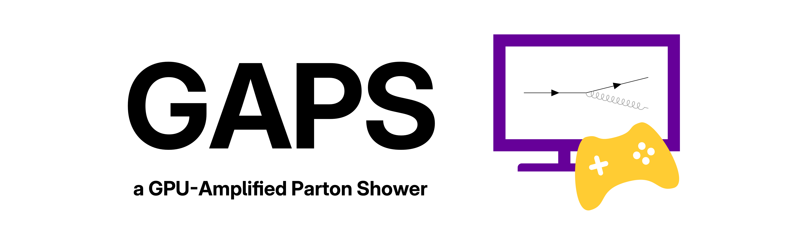

# 

<!-- # GAPS: a GPU-Amplified Parton Shower -->

> **Version 2.0.0-beta**: Initial and Final State Shower, MC@NLO Matching

This is for Codebase for:

- [M. H. Seymour and S. Sule, _An Algorithm to Parallelise Parton Showers on a GPU_, SciPost Phys. Codebases 33 (2024)](https://scipost.org/SciPostPhysCodeb.33)
- M. H. Seymour and S. Sule, _An NLO-Matched Initial and Final State Parton Shower on a GPU_ (TBD)

The aim of this project is to demonstrate how a Parton Shower Veto Algorithm can be reorganised to run in parallel on a GPU without altering the algorithm itself.

## What can the code do on the GPU?

The code is an NLO+Shower generator. It can simulate two processes:

- **Electron-Positron Collisions at LEP @ 91.2 GeV** 
  - Process: $e^+ e^- \to Z/\gamma \to q \bar{q}$ at LO/NLO
  - Observables: Durham Jet Rates and Event Shapes

- **Z Production at the LHC @ 13 TeV**
  - LO Process:  $p p \to Z/\gamma \to e^+ e^-$
  - NLO Process: $p p \to Z$
  - Observables: $Z$ Observables and Anti-$k_T$ Jets

## Requirements

You will need an NVIDIA GPU with CUDA Compatibility 7.0 [[Guide](https://developer.nvidia.com/cuda-gpus)]. To build the code, you will need `cmake`, `g++`, `python` and NVIDIA's `nvcc` compiler.

## Running the Code

The executable ```rungaps``` is written to simplify the use of the code. One can execute the command:

```bash
./rungaps
```

NB: When running the first time, the code will install LHAPDF-GPU, packaged with the code [[LHAPDF Repo](https://gitlab.com/hepcedar/lhapdf/-/tree/kokkos_version/)]

This command should build the program and generate 10000 events on the GPU. More customisation options are available, and are listed below:

```bash
# Simulate N Events on GPU (Default)
./rungaps -p <LEP/LHC> [-nlo] -n nevents

# Simulate N Events on CPU
./rungaps -p <LEP/LHC> [-nlo] -n nevents -r cpu

# Simulate N Events over multiple CPUs
./rungaps -p <LEP/LHC> [-nlo] -n nevents -r cpu-cluster -ncpu ncores
```

The histograms are saved as Yoda files [[arxiv:2312.15070](https://arxiv.org/abs/2312.15070)]. To generate the plots, use Rivet [[2404.15984](https://arxiv.org/abs/2404.15984)] as follows:

```shell
rivet-mkhtml --mc-errs -c test/plots.conf <yoda file>
```

## Going Further

You can adjust the following parameters:

- `-e, --root_s`: Adjust the centre of mass energy
- `-asmz, -fixas`: Adjust $\alpha_s(m_Z)$, use fixed $\alpha_s=\alpha_s(m_Z)$
- `-noshower`: Skip the shower section (hard subprocess only)
- `-t_c`: Adjust the Shower Cutoff
- `-n_em_max`: Limit the number of emissions, including the MC@NLO Emission
- `-t`: Number of threads per block on the GPU
- `-do_partitioning`: Do Event Record Partitioning (GPU Speedup Trick)
- `-nsys, -codecarbon, -gprof`: Profiling Tools

To learn more about the code and how it all works, see the [documentation](doc/README.md).

***

### Sid Sule + Mike Seymour, September 2025

For issues and queries, email: [siddharth.sule@manchester.ac.uk](mailto:siddharth.sule@manchester.ac.uk)
