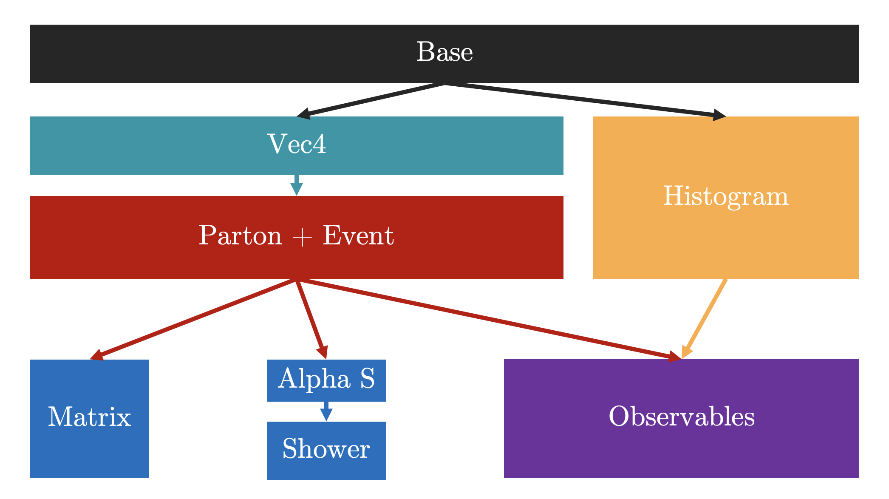

# Code Structure

> **Version 1.0.0**: All code in `include` and `src`, to be split by component later

While the focus of the paper is the parton shower, there are a bunch of components which are necessary plus theya are exciting in their own right. Below is a figure of the structure of the classes.

NOTE: The code structure is identical for the C++ and CUDA generators. We want to demonstrate that one can get a speedup without altering the actual code much.

Let's go through the Classes:

- Base: All the neccessary definitions and settings are defined here. For now, here is where you can adjust the Centre of Mass Energy and Cutoff, as well as the physical contents.

- Vec4: This contains the definition of the four vector - the primary tool for all our kinematics. This is one of Many files that are header only! This is because the code inside a .cu file might not be accessible to another .cu file (weird I know, could be me struggling to do things the C++ way though!)

- Parton and Event: This is the backbone of the Generator. Unlike the original tutorial, we choose to store all and any properties of the code in these objects. The parton class holds the ID, momentum and colour of the parton. The event class stores an array of partons (has to be static because CUDA won't allow dynamic arrays/not good for speed). It also stores a bunch of parameters like dxs, observable values and acts as a temporary store for shower parameters. Good to have everything in there rather than in separate arrays!

- Histogram: This has a class for Bin and Histograms. Fun feature - CUDA allows you to do Atomic operations, i.e. I can bin all my events at the same time! Makes things unbelievably fast!

- Physics Classes
  - Matrix: Computes the matrix element for $ee \to qq$
  - Shower: Runs the final state shower
  - Observable: Calculates the observable and bins the Histogram
