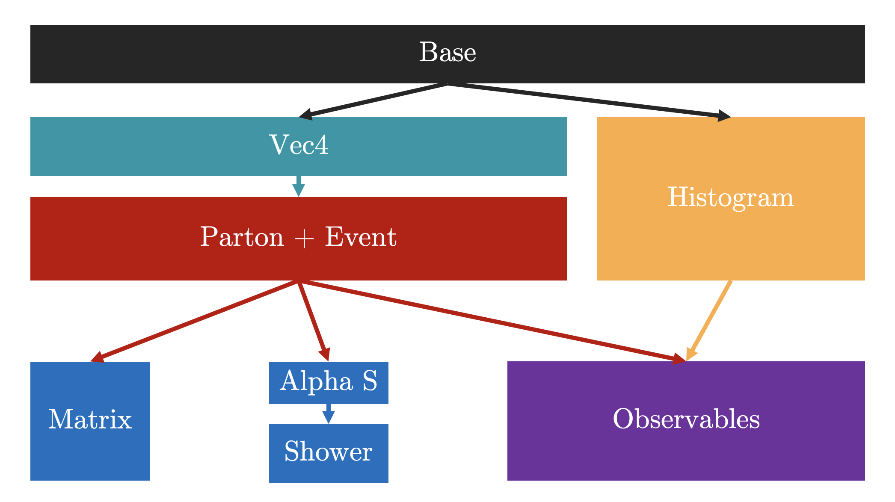

# Code Structure

While the focus of the paper is the parton shower, several necessary components need to be implemented to run it. Below is a figure showing the structure of the classes.

**Note**: The code structure is identical for the CPU and GPU generators. We want to demonstrate that one can get a speedup without altering the code much.

Let us go through the Classes:

- Base: All the necessary definitions and settings are provided here.

- Vec4 contains the definition of the four vectors—the primary tool for all our kinematics.

- Parton and Event: This is the backbone of the Generator. Unlike the original tutorial, we choose to store all and any properties of the code in these objects. The parton class holds the ID, momentum and colour of the parton. The event class stores an array of partons (it has to be static because CUDA will not allow dynamic arrays/unsuitable for speed). It also stores several parameters, like the differential cross section and observable values, and acts as a temporary store for shower parameters. It is good to have everything in there rather than in separate arrays!

- Histogram: This has a class for Bins and Histograms. Fun feature: CUDA allows you to do Atomic operations, i.e., I can bin all my events at the same time.

- Physics Classes
  - Matrix: Computes the matrix elements
  - Shower: Runs the shower
  - Observable: Calculates the observable and bins events to the Histogram

---

## Navigation

- [📚 Documentation Home](../README.md)
- [🏠 Repository Home](https://gitlab.com/siddharthsule/gaps)
