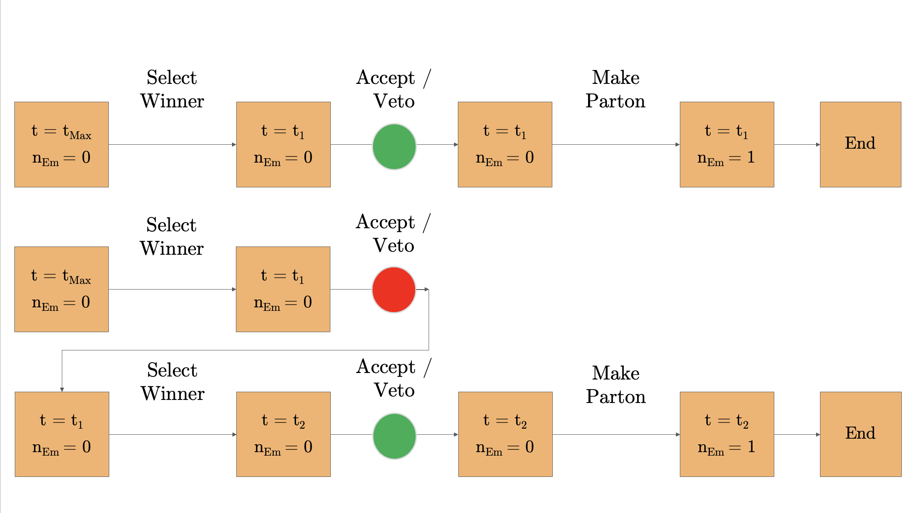
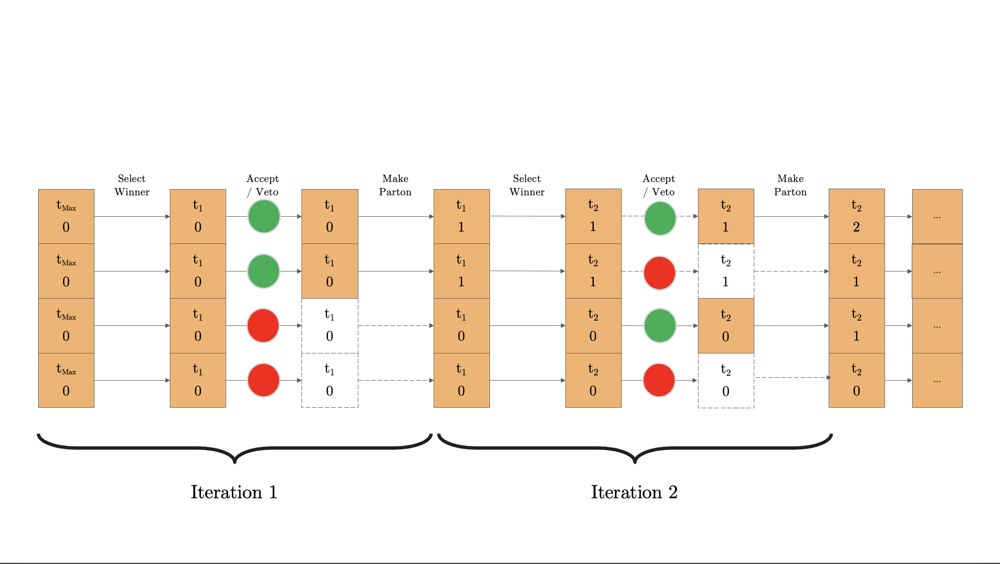

# Parton Shower

Now I won't really go too much in depth with this page, there's a whole paper on it... you're most likely here after reading it, too...

Either way, here is a breakdown: Due to Independent Thread Scheduling [1](https://developer.nvidia.com/blog/inside-volta/), we have access to for and while loops. This means that we can adapt our original veto algorithm:

Into something like this:

The GPU handles each event independently and works regardless of its size. As a security measure, the "Sync GPU and Check Everything" function is run after each step so that there are no spills. Furthermore, when a thread encounters a veto event, it can skip it.

Just a few things to point out that may not have made it to the paper:

- Max number of Partons: It is much faster to have a static event size than a dynamic size, as most of the time is used to manage memory. So we set the maximum number of partons to about 30 (we usually see at most 17-18 partons from the shower). While we are in the LEP phase, we shouldn't have a problem, but once we soon come to LHC, we'll have to be careful of this

- Splitting Kernels as a "shared" object: I have had a LOT of trouble making the splitting kernel an object that can be shared across the device without making a copy. So, instead, as a first solution, we manually sample through all kernels and have the relevant functions written into the Cuda kernel. One possible improvement to this could be a code system where the code determines the splitting, the case (FF, FI, IF, and II) and the relevant partons (see v1.1.0)

Besides that, the code is thoroughly commented on so a potential developer can find it helpful.
