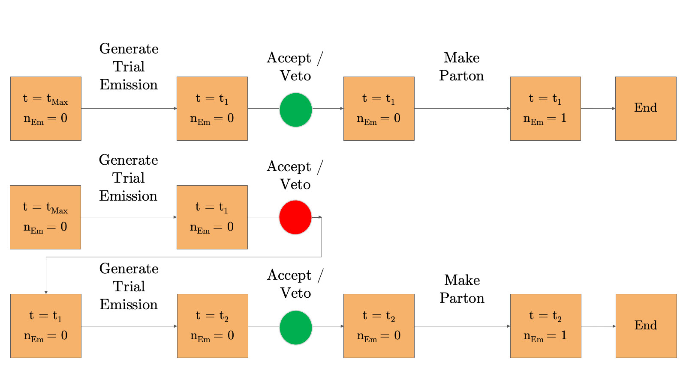

# Parton Shower

The essence of adapting the veto algorithm for GPUs is to break its steps down and do them for every event in parallel. So you go from something like this:
 

Into something like this:

The GPU handles each event independently and works regardless of its size. As a security measure, the "Sync GPU and Check Everything" function is run after each step to prevent spills. Furthermore, when a thread encounters a veto event, it can skip it.

Just a few things to point out that may not have made it to the paper:

## Max number of Partons

It is much faster to have a static event size than a dynamic size, as most of the time is used to manage memory. So we set the maximum number of partons to about 50, covering LEP and LHC.

## Splitting Kernels

I have had much trouble making the splitting kernel an object that can be shared across the device without making a copy. So, instead, as a first solution, we set up a "switchboard". When generating trial emissions, for every parton, a list of all possible splitting functions is created, where the splitting is represented by a code. We have many splitting functions:

- four CASES ($\text{FF}$, $\text{FI}$, $\text{IF}$, $\text{II}$)
- three or four possible TYPES ($q \to qg$, $q \to gq$, $g \to gg$, $g \to q\bar{q}$, $g \to \bar{q}q$)
- five FLAVOURS of quarks ($d, u, s, c, b$) and each of their antiquarks
- at most, in total: 4(10 + 10 + 1 + 5) = 104 splitting functions

So we need to organise ourselves with some structure, as a first step. Let us use four-digit codes to identify the splitting functions:

- first: CASE ($\text{FF}$, $\text{FI}$, $\text{IF}$, $\text{II}$) - 0, 1, 2, 3
- second: SPLITTING ($q \to qg$, $q \to gq$, $g \to gg$, $g \to q\bar{q}$, $g \to \bar{q}q$) - 0, 1, 2, 3, 4
- third: is the emitter an ANTIPARTICLE - 0, 1 (quark, gluon is 0)
- fourth: FLAVOUR - 1, 2, 3, 4, 5; 0 for gluon

Examples:

- $\text{FF} \,  u \to u g$ = `0 0 0 2`
- $\text{FI} \, \bar{u} \to \bar{u} g$ = `1 0 1 2`
- $\text{IF} \, g \to g g$ = `2 2 0 0`
- $\text{II} \, g \to b \bar{b}$ = `3 3 0 5`
- $\text{II} \, g \to \bar{b} b$ = `3 4 0 5`

This way, we can easily identify the splitting functions and select the correct one using a switch-case statement. This method can be used for value, estimate, integral and generate_z functions.

Besides that, the code is thoroughly commented on, so a potential developer can find it helpful.

---

## Navigation

- [📚 Documentation Home](../README.md)
- [🏠 Repository Home](https://gitlab.com/siddharthsule/gaps)
