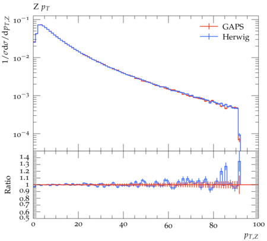

# Validation of GAPS vs Herwig

While this is a computationally oriented study, it is essential to ensure that the parton shower being put to test accurately simulates emissions, as this will yield a realistic result for execution time and energy. In GAPS 2, our goal was to simulate a production-ready shower, so we validated it with results from one of the NLO-Matched Dipole Showers in Herwig [[herwig.hepforge.org](https://herwig.hepforge.org/), [arXiV:1109.6526](https://arxiv.org/abs/1109.6256)].  

Before we start, we want to mention that although our shower and Herwig's shower have the same splitting functions, kinematics and colour configuration, there are differences in the implementations that make a grave impact on the results:

- **Sampling and Diverging Jacobians**: An issue with Dipole Shower Models is that in Initial State Emissions, the Sudakov Form Factor contains Jacobians with non-trivial divergences. These divergences are dealt with in Herwig by setting the overestimate using phase space sampling, using a tool called ExSample. Now, we are using a traditional veto algorithm with analytic overestimates, which is why our code may not produce the exact emission phase space as Herwig (this is more importantly an issue with the shower models - diverging terms like this are disastrous for Monte Carlo tools and should be avoided in future models!)

- **Remnant Generation and Decays**: After the parton shower has been simulated, Herwig checks the incoming partons. If they are gluons, or strange, charm or bottom quarks, forced splittings occur. This is done to ensure that the incoming partons are up and down quarks, such that the beam remnants can be defined as diquarks. This is deeply rooted in Herwig's infrastructure, so we cannot turn it off, unfortunately. The best we can do is omit remnant and its children from our analyses

- **PDF Inputs**: By default Herwig applies scale freezing and $x$-extrapolation when evaluating the PDF Ratio. We turn this off.

Below, we will compare the results of GAPS and Herwig. We can work with the simple $pp \to Z$ example, and fix to down quarks only. The plots were made using Rivet [[2404.15984](https://arxiv.org/abs/2404.15984)]

## Hard Subprocess Only

This is spot on between the two codes.

| Z Mass | Z Rapidity |
|:---:|:---:|
|  |  |

## One Emission

Again, pretty good agreement here.

| Z pT | Z Rapidity |
|:---:|:---:|
|  |  |

## Two Emissions

Now, deviations start propping up. From the LEP results (see [results](results.md)), we know that final state radiation is in good agreement for the first few emissions, indicating that the initial-state emissions are likely the source of the issues.

| Z pT | Z Rapidity |
|:---:|:---:|
|  |  |

| J1 pT | J1 PseudoRapidity |
|:---:|:---:|
|  |  |

| J2 pT | J2 PseudoRapidity |
|:---:|:---:|
|  |  |

## Concluding Remarks

We hope that this validation is enough to demonstrate the physics accuracy of GAPS. The production and decay of remnants are still an important part of event generation and would be a useful addition in a future version.

---

## Navigation

- [📚 Documentation Home](../README.md)
- [🏠 Repository Home](https://gitlab.com/siddharthsule/gaps)
